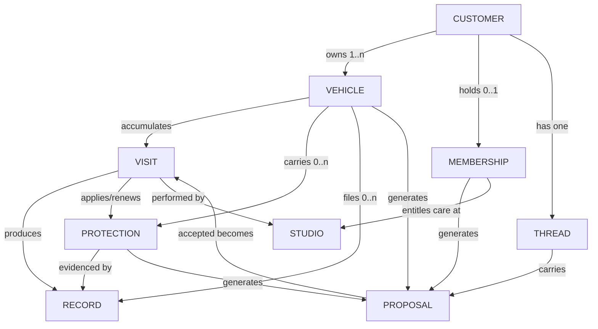

# AUTOMODZ CUSTOMER OPERATING SYSTEM
### The permanent constitution of the customer product

**Status:** awaiting ratification. No code, no mockups, no implementation.
**Replaces:** `CX-V3-REBOOT-AUDIT.md` and `CX-V3-FINAL-BLUEPRINT.md` in their entirety. Where this document is silent, the blueprint's craft sections (motion values, typography scale, copy rules) carry forward; where they conflict, this document wins.
**Horizon:** ten years. The test for every decision below is not "does this ship V3?" but "does this survive insurance, fleets, and a second studio without redesign?"

---

# PART I — PHILOSOPHY

## 1 · Product Philosophy

The customer does not use an app. **The customer owns a set of relationships — with their vehicle, with its protection, with the studio — and the product is the place those relationships are visible and alive.**

Constitutional sentences (unchanged from the blueprint, ratified by the founder):

1. The car is the product.
2. Every surface answers *"what is happening with my car?"* — never *"which feature do you want?"*
3. Ownership is daily; transactions are occasional. The product is built for the 355 days between visits.
4. Photography first, content second, controls last.
5. The emotional hierarchy is fixed: **My Car → Current Care → Protection → Memories → Relationship → Booking.** No surface may invert it.
6. Everything derives from real data. Absence degrades elegantly; nothing is faked.

One sentence added by this document:

7. **The product is an object system, not a page system.** Screens are temporary; objects are permanent. We will redesign views many times over ten years; we will never redesign the objects.

## 2 · Design Philosophy

Instagram meets Apple Wallet, held to gallery discipline: large photography, Studio White chrome (light-first customer surfaces; graphite ink; admin and store remain always-dark), almost no borders, almost no cards, information layered over imagery, sentence-case concierge language, motion as state-change only. The full craft law (tokens, type scale, spacing, motion values, copy rules, empty/loading doctrine) carries forward from the blueprint §6–§15 unchanged and is not repeated here — it is *how* things look; this document is *what things are*.

---

# PART II — THE OBJECT MODEL

## 3 · Objects, not pages

The product is built from **nine permanent objects**. Every screen is a *view of an object*; every notification is an *object speaking*; every future feature is a *new instance or subtype of an existing object*. If a proposed feature cannot be expressed in this model, the model — this document — must be amended first, deliberately.

| Object | What it is | Permanent? |
|---|---|---|
| **Customer** | The human (later: household, business) | permanent |
| **Vehicle** | The car — the product's centre of gravity | permanent per car |
| **Visit** | One period of custody: the car in our hands | permanent record once completed |
| **Protection** | Anything that shields the vehicle over time (coating, PPF, plan → insurance, warranty, RSA) | lives and expires |
| **Record** | A document about the vehicle (care record/invoice, RC, policy, inspection report) | permanent |
| **Membership** | The customer's standing with the Club | renews or lapses |
| **Studio** | The party that performs care (today one; tomorrow many) | permanent |
| **Thread** | The concierge conversation — every message the relationship has exchanged | permanent |
| **Proposal** | A suggested act of care, awaiting the customer's yes (see §10 — this object *replaces booking*) | transient until accepted → becomes a Visit |

## 4 · Ownership graph



**Ownership rules (who owns whom):**

- **Customer owns Vehicles, Membership, and the Thread.** These are the only things attached to the human. Everything else attaches to a vehicle — because when a car is sold, its Visits, Protections, and Records must be able to travel with it (this is the resale differentiator: a transferable, verified history).
- **Vehicle owns Visits, Protections, Records.** The vehicle is the aggregate root of everything physical.
- **Visit produces Records and Protections** but never owns them — it hands them to the Vehicle. A visit is an *event*; its outputs are *state*.
- **Studio owns nothing customer-side.** It is a party stamped onto Visits and Memberships. This single design decision makes multi-studio a data change, not a redesign.
- **Proposal is owned by whatever generated it** (a Protection nearing expiry, a Vehicle's care cadence, a Membership benefit, the Studio via the Thread) and dies into a Visit or dismissal.

## 5 · Where future modules plug in

Every item on the five-year list lands inside an existing object — none requires new architecture:

| Future capability | Plugs in as |
|---|---|
| Insurance | new **Protection** type (`insurance`) + its policy as a **Record**; renewal = the existing expiry engine |
| Roadside Assistance | new **Protection** type (`rsa`) + a new **Visit kind** (`rescue`) with its own moment set |
| Warranty / AMC | **Protection** types |
| Vehicle documents (RC, PUC) | **Record** kinds with expiries — same expiry engine as Protection |
| Full service records | **Visit** kind (`service`) + odometer field on Visit |
| Fuel tracking | a **Signal** stream on Vehicle (see below) |
| Tyres | **Protection** type (tread as expiring asset) + `service` Visits |
| Accessories | fulfilment **Visit** kind + Records; offered through the **Thread**, never a store tab |
| Marketplace / resale | the Vehicle's history *is* the listing; `/cars` consumes the object graph |
| Financing | **Record** kind + **Proposal** source |
| Multiple studios | already a party on Visit/Membership |
| Pickup & drop tracking | two new phases inside the **Visit** lifecycle (§8) — not a new object |
| AI vehicle health | a **Signal** interpreter that emits **Proposals** ("The C 43's ceramic is due its maintenance wash") |
| Family garage | **Customer** becomes a *party group*; Vehicles gain viewers vs owners |
| Business fleets | same party-group mechanism + a fleet roll-up *view* — the objects don't change |

One deliberately reserved tenth object, **Signal** — `{vehicle, source, kind, value, at}` (odometer readings, fuel fills, AI assessments, sensor data someday). Not built in V3; the schema slot exists so health/fuel/telemetry never require rearchitecting.

---

# PART III — LIFECYCLES (the backbone of UX)

Every major object is a state machine, and **the UI is a rendering of these machines** — screens don't have states; objects do.

## 6 · Customer lifecycle

```
INVITED → ONBOARDING → OWNER → (MEMBER ⇄ OWNER) → DORMANT → RETURNING
                          │                            │
                          └────────── ADVOCATE ────────┘
```

- **Onboarding** ends when a Vehicle with a portrait exists — not before.
- **Owner → Member** is the relationship deepening, not an upsell moment; it's offered when the data justifies it (2nd+ visit, wash cadence that a plan would cover).
- **Dormant** (no visit in ~2× their historical cadence) triggers exactly one concierge line, ever. Returning customers see their car unchanged — the passport never resets. Dormancy is a *state we respond to once*, not a re-engagement campaign.
- **Advocate** is recognised (referral used) and thanked in the Thread, not gamified.

## 7 · Vehicle lifecycle

```
ADDED → PORTRAIT_MADE → IN_CARE_CYCLE ⟳ (visits accumulate, protections live and expire)
      → LISTED (optional, resale) → TRANSFERRED or RETIRED
```

- A vehicle is *incomplete* until photographed; the UI treats the portrait as part of creation.
- **In-care-cycle** is the permanent middle: the loop of §8–§9. The vehicle's "health" at any instant = the sum of its live Protections + care cadence — this is what the truth line renders.
- **Listed:** the passport generates the `/cars` listing. **Transferred:** history travels with the car (new owner sees the chapters; amounts are redacted). **Retired** vehicles remain in Memories — the story is never deleted.

## 8 · Visit lifecycle (the heart of the product)

The visit is redesigned from "tracker" to **a five-act hospitality experience** (§11). Its machine, superset-ready for pickup/drop:

```
PROPOSED → CONFIRMED → [PICKUP*] → ARRIVED → INSPECTED → IN_CARE ⟳ → FINISHED → REVEALED → [RETURN*] → ARCHIVED
                                                                                     │
                                                    (*future phases — slots exist)   └→ becomes a Chapter (Record)
```

- **Proposed:** exists as a Proposal (§10). **Confirmed:** the evening-before prep note is scheduled.
- **Arrived** opens custody: arrival photograph = the custody handshake ("your car, in our hands, at 9:58").
- **Inspected** is new and load-bearing: the studio's honest walk-around — condition notes + inspection photos *before* work. This is where trust is manufactured (see §11).
- **In-care** advances through named work moments with photo evidence.
- **Finished → Revealed:** the finished car is photographed *before* the customer sees it; the reveal (before/after, craftsman note, amount) is a designed moment, then handover.
- **Archived:** the visit dissolves into a Chapter on the vehicle; its outputs (Protections, Records) are already filed. Ops's raw 7-status machine maps into these acts via one translation layer; ops vocabulary never renders customer-side.

## 9 · Protection lifecycle

```
APPLIED → ACTIVE → WANING (30d) → EXPIRING (7d) → EXPIRED → (RENEWED → ACTIVE) | LAPSED
```

- Every completed qualifying visit **auto-creates** its Protection row (type, evidence photos, expiry from warranty duration). Protections are born from work, not data entry.
- **Waning** and **Expiring** each emit one Proposal + at most one push. **Expired** is rendered calmly ("The ceramic has run its course") — never as red failure.
- Renewal is a Proposal accepted → a Visit → a fresh Protection linked to its ancestor, so the passport shows continuity of care ("protected since 2026").
- Insurance/warranty/RSA later traverse this identical machine — the expiry engine, the proposals, the truth-line surfacing are all written once.

## 10 · Membership lifecycle

```
INVITED → JOINED(pending) → ACTIVE ⟳ (benefits consumed) → RENEWING (14d) → RENEWED | GRACE(7d) → LAPSED → REJOINED
```

- **Active** is where design effort goes: benefits are *consumed visibly in context* ("Thursday's wash — covered, 5 left this cycle"), the card is an object, recognition happens at the studio.
- **Renewing** emits one Proposal; **Grace** keeps benefits alive for 7 days with one honest line — no punishment mechanics. **Lapsed** members keep their history and card (greyed, "member 2026–2027"); rejoining restores continuity. Status anxiety is never a retention lever.

---

# PART IV — THE TWO GREAT CHALLENGES

## 11 · Booking, challenged again: care is proposed, not requested

Interrogated per the founder's question — *can booking almost disappear?* Answer: **yes, structurally.** The blueprint still had "Book" as the capsule's idle verb; that was residual transaction thinking. This document replaces booking with the **Proposal system**:

- **Booking stops being something the customer initiates and becomes something the customer approves.** The system — protection expiries, care cadence, membership benefits, seasonal sense ("pre-monsoon underbody check"), and the concierge personally — generates Proposals: *"The C 43 is due its maintenance wash. Thursday 10:00 is free — shall we?"* One tap accepts; the slot, car, and service are already chosen; the Visit is born Confirmed.
- **"Book" disappears as a primary action.** The capsule idle-state shows the current best Proposal, or nothing. There is no plus button, no "Book now" CTA anywhere at rest.
- Sources, in trust order: Protection expiry → cadence → Membership entitlement → Studio/concierge (human-sent through the Thread) → seasonal. Every proposal must name its reason ("because the coating's first maintenance is due") — unexplained suggestions are banned; unexplained suggestions are marketing.
- **The manual path survives but demotes:** a customer who *wants* to book says so to the concierge — long-press the capsule → "Arrange a visit" → the same three-question sheet from the blueprint. It exists; it is simply no longer architecture.
- Budget: at most **one open proposal per vehicle** at a time. Proposals expire silently. A dismissed proposal never returns in the same form. This keeps the system a concierge, not a nag.

The end-state sentence: *the customer never thinks about booking; they occasionally say "yes" to care.*

## 12 · The visit, challenged again: from tracker to hospitality

The blueprint's Live Care was still, structurally, a tracker — a status renderer with better words. Rebuilt around the founder's five questions:

- **Anticipation (before):** the confirmed visit has a *countdown presence* on the Now layer — prep note the evening before, "We're ready for the C 43" the morning of, the assigned craftsman named when ops assigns one. Arrival instructions (where to park, chai's ready) make the drop-off itself designed.
- **Confidence (arrival + inspection):** the custody handshake — arrival photo, timestamped, "in our hands." Then the **inspection act**: the walk-around findings, honestly, with photos — existing swirl marks, a kerbed rim, noted *before* work. Nothing builds trust like being told what's wrong before being sold what's next. (This is also the studio's protection against disputes — the object model gives ops a reason to love it.)
- **Enjoyment (during):** waiting becomes watchable. The in-care stage runs as a quiet, photo-driven **story of craft** — close-ups of the work as the studio posts them, each captioned by what's happening and who's doing it. The right benchmark isn't Domino's; it's a restaurant's open kitchen: you don't watch because you doubt them — you watch because it's beautiful. Optional, user-controlled photo-drop notifications for those who want the drip.
- **Delight (the reveal):** the finished car is photographed before collection, and the customer's first sight of the result is *in the app* — the reveal moment: finished portrait, before/after, the craftsman's one-line note. Collection then confirms what they've already fallen for.
- **Trust (throughout):** honest time expectations that update ("running 40 minutes long — the interior deserved it"), amounts visible before arrival, and the whole visit compiling in real time into the Chapter they keep. Nothing is hidden, so nothing needs tracking.

The word "tracker" is retired from the product's vocabulary. The visit is a **stay**.

## 13 · Photography, challenged: the evidence chain

Photography stops decorating and starts **communicating**. Each photograph has a *job*, and together they form the visit's evidence chain:

| Photograph | Act | What it communicates |
|---|---|---|
| **Portrait** | onboarding / periodically refreshed by studio | identity — "this is my car" (the home screen) |
| **Arrival** | Arrived | custody — "we have it, safely, at 9:58" |
| **Inspection** (2–4) | Inspected | honesty — "here is its true condition" |
| **Craft** (1–3) | In-care | competence — "this is the work, happening" |
| **Finished** | Finished | the reveal — the emotional payoff |
| **Detail** | after protection work | evidence on the Protection row — "this coat, on this panel" |

Evolution through the visit: wide (custody) → close (honesty) → macro (craft) → wide again (reveal). Minimum viable visit = arrival + finished (two phone photos); the full chain is the standard the studio grows into. Every photo is timestamped, attached to its act, and flows automatically to its object (visit → chapter; detail → protection; new portrait → vehicle). The ops-side capture flow is therefore a **first-class admin feature in the roadmap, not an enablement afterthought** — the customer product's ceiling is set by the studio's camera habit.

---

# PART V — ARCHITECTURE OF THE INTERFACE

## 14 · Navigation, stress-tested (the founder's challenge)

The blueprint proposed no navigation. Stress-tested against the eight real arrival intents — honestly, it **partially fails**:

| Arrival intent | Pure-scroll cost | Verdict |
|---|---|---|
| "What's happening with my car?" | zero — it's the first frame | ✅ perfect |
| "I want to book" | capsule tap | ✅ |
| "See my second car" | one swipe | ✅ |
| "Check my membership" | scroll past 4 layers | ⚠️ indirect |
| "Renew protection" | scroll past 2 layers | ⚠️ |
| "Find an old invoice" | scroll to Memories, then hunt a 40-chapter timeline | ❌ fails outright at scale |
| "Update my profile" | know the avatar exists | ⚠️ discoverability |
| "Contact AutoModz" | scroll to the very bottom | ❌ the *relationship* product buries "talk to us" last |

Conclusion: **pure scroll is right for the glance and wrong for recall.** A product that's beautiful on day 30 and infuriating in year 3 (200 chapters, 3 cars, 6 protections) fails the ten-year test. But the failure isn't an argument for tabs — tabs would resurrect feature-thinking. The failure is an argument for a *second altitude*.

**The ruling: two-altitude adaptive navigation.**

1. **Altitude 1 — the Glance.** The Car, exactly as designed: full-bleed portrait, truth line, layered scroll, swipe between cars. Zero visible navigation chrome. This serves the daily visit, which is 90% of opens.
2. **Altitude 2 — the Concierge Desk.** The capsule, **tapped when idle** (when live, it opens the visit as before), expands into a full-screen sheet — the product's one piece of true navigation, and it is *object-oriented and adaptive*:
   - **Top: a suggestion, if one exists** (the open Proposal — care proposed, not requested).
   - **Middle: the objects** — This car's care · Protection · Records · Club · The studio (contact, directions) · You. Six rows, plain language, each opening the relevant layer/view directly. Rows appear only when their object exists (no Club row before the invitation is relevant; Records appears after the first visit).
   - **Bottom: search** — one field across chapters, records, and protections ("ceramic 2026", "March invoice"). This is the year-3 answer: recall is a *query*, not a browse.
   - The Desk is adaptive in content and in prominence: during a live visit it leads with the visit; near an expiry it leads with the renewal; at total rest it's simply the quiet index.
3. **Nothing else.** No tab bar, no hamburger, no floating buttons beyond capsule + avatar (avatar remains a shortcut to You; it also lives in the Desk for discoverability). Back remains down/left-edge. Takeovers still present themselves by state.

Why this survives ten years: every future module (insurance, fuel, fleet roll-up) becomes at most *one new row in the Desk* and *one new layer or view* — the Glance never gains chrome, and the Desk grows like an index, which is the one thing that's allowed to grow. The blueprint's mistake was treating "no navigation" as the principle; the real principle is **"navigation must never compete with the car"** — an index behind the capsule honours that; eight swipes to an invoice does not.

## 15 · State architecture

- **One store, object-shaped:** customer, vehicles[], visits[], protections[], records[], membership, thread, proposals[] — mirroring §3 exactly. Views select from objects; no view owns data. (Zustand slices per object; Firestore listeners per object collection; the store is the single source and persists last-known state for instant cold-start truth.)
- **Derived, never stored:** the truth line, care cadence, protection health, proposal eligibility — all pure functions over objects (`truthOf(vehicle)`, `careMoment(visit)`, `healthOf(protections)`). This keeps every future rule change a function edit.
- **The translation layer is a hard boundary:** ops statuses, ops vocabulary, and admin concepts exist only behind `careMoment()` and friends. Grep-enforceable: no `in_progress`/`quality_check` string may appear under the customer surface tree.
- **State drives presentation:** takeovers, capsule text, Desk ordering, and notifications are all renderings of object state — there is no navigation-state machine separate from the object machines of Part III.

## 16 · Screen inventory (complete)

The entire customer product, final:

| # | Surface | Kind | It exists because… |
|---|---|---|---|
| 1 | **The Car** | root | ownership needs one canonical place; it is the top and cannot merge upward |
| 2 | **Live Visit** | takeover (state) | a minutes-granular stay cannot share a scroll with a passport |
| 3 | **Chapter** | push (document) | a completed visit is permanent, addressable, shareable (absorbs `/invoice/[id]`) |
| 4 | **Concierge Desk** | capsule expansion | the recall/intent altitude — §14's ruling |
| 5 | **Onboarding** | one-time flow | the root requires a photographed vehicle to exist |
| — | Sheets: Accept/adjust proposal · Arrange a visit · Join Club · You · Add/Edit car · Adjust visit | sheets | tasks with an end state |

Five surfaces, six sheets. The Desk is the only addition over the blueprint, and it is the concession the stress test demanded. Everything killed in the blueprint stays dead (Home, Garage, History, tracker-page, Membership-page, Profile, Notifications/Offers/Refer, tab bar, `/dashboard/cars`). Public surfaces (`/`, `/cars`, `/store`, chapter-share) are unchanged in scope.

## 17 · Component inventory (complete)

Twelve components — the blueprint's eleven plus one (`Desk`); a thirteenth requires amending this document:

`Portrait` · `TruthLine` · `Capsule` · `Desk` · `Layer` · `PhotoBand` · `MemoryEntry` · `MomentStage` · `MemberCard` · `Sheet` · `Field` · `Action`

Text primitives (`Display/Body/Data/Whisper`) and motion constants carry forward from the blueprint. The V2 deletion list carries forward in full.

## 18 · Notification & concierge philosophy (consolidated)

- Notifications are **objects speaking through one voice** — the concierge. Budget: ≤2 pushes/week outside live visits; live-visit acts (Arrived, Revealed always; craft photos opt-in); one push per lifecycle edge (Waning, Expiring, Renewing) — the lifecycles of Part III *are* the notification schedule; nothing else may emit.
- The **Thread** is the permanent home of everything the concierge has ever said — reachable from the Desk and the Relationship layer; WhatsApp deep-link at launch, native thread when ops can staff it. No inbox, no bell icon, ever.
- Voice rules carry forward verbatim (blueprint §15): one calm expert host; the car by name; reasons always given; no urgency, guilt, emoji, or ops vocabulary.

---

# PART VI — SCALABILITY & ROADMAP

## 19 · Scalability architecture & expansion model

The growth contract, stated as law:

1. **New capability = new instance/subtype of an existing object** (§5's table). If it needs a new object, amend Part II first.
2. **New surface area = a Desk row + a layer or view.** The Glance gains no chrome, ever.
3. **New proposals = new proposal source** obeying the one-open-proposal budget and the named-reason rule.
4. **New parties = the party mechanism** (studios, family members, fleet managers) — never new products.
5. A capability ships only when it is **true** (real data) and **quiet** (fits the truth-line/layer/Desk grammar).

Worked examples of the far end: *fleets* = a party group owning many vehicles + one roll-up view in the Desk ("Your fleet: 2 in care, 1 expiring") with each car still a full passport; *AI health* = a Signal interpreter emitting Proposals — it gets no screen at all, because in this architecture intelligence manifests as *better sentences in the truth line and better-timed proposals*, which is exactly what a concierge is.

## 20 · Implementation roadmap

Same delete-as-you-go discipline as the blueprint; re-sequenced for the object model. Each phase leaves the app releasable.

- **Phase 0 — Objects + constitution in code.** The object store (§15), lifecycle machines as pure functions, translation layer, derived-truth functions; Studio White tokens; the 12 components + text primitives; V2 primitive deletions. *Gate: lifecycle unit tests green; styleguide route renders all 12; no ops vocabulary under customer tree.*
- **Phase 1 — The Glance.** The Car: portrait, truth line, capsule (collapsed), multi-car swipe, layer skeleton on real objects; You sheet. Deletes: dashboard home, bottom nav, profile/notifications/offers/refer routes, `/dashboard/cars`. *Gate: 3-second daily glance from cold start on cached truth.*
- **Phase 2 — The Desk + Proposals.** Capsule expansion, object rows, search across chapters/records/protections; proposal engine v1 (expiry + cadence sources), accept-proposal sheet, arrange-a-visit sheet. Deletes: the 1,085-line wizard. *Gate: every §14 arrival intent reachable in ≤2 gestures; accepted proposal creates a Confirmed visit.*
- **Phase 3 — The Visit.** Five acts, evidence chain rendering, reveal + handover, takeover + dissolve animations; **admin-side capture flow ships in this same phase** (arrival/inspection/craft/finished photos + act advancement on the studio board — it is the ceiling of Phases 3–4, so it is not deferred). Deletes: history-page tracker UI. *Gate: full visit simulated end-to-end; degraded (photo-less) mode also verified.*
- **Phase 4 — Memory + Records.** Memories layer, Chapter page, share URL absorbing `/invoice/[id]`, in-context rating, V2 booking data migrated into chapters. Deletes: history route. *Gate: a 2025 V2 booking renders as a dignified chapter.*
- **Phase 5 — Protection + Identity.** Protection registry + lifecycle (auto-creation from visits, waning/expiring proposals + pushes), documents stack, value/sell link. *Gate: completed ceramic visit auto-creates its protection; its expiry emits a proposal on schedule.*
- **Phase 6 — Relationship + Club.** MemberCard, join flow, benefit-consumption-in-context, renewal lifecycle, referral, Thread deep-link. Deletes: subscriptions page. *Gate: join → active → renewing loop verified against admin.*
- **Phase 7 — Onboarding + the ten-year polish.** First-run (car + portrait), empty/loading doctrine sweep, reduced-motion + notification-budget audits, performance (portrait LCP <2.5s on 4G), final V2 code sweep, docs superseded-markers. *Gate: journeys §5 (blueprint) run end-to-end; grep finds no import of any deleted component.*

**Definition of done for the Customer OS:** a customer with two cars, an active membership, one live visit, and one expiring protection can serve all eight arrival intents of §14 in ≤2 gestures each, without ever seeing a screen outside §16 — and adding a hypothetical "insurance" protection type requires touching data and copy, not architecture.

---

*This document is the permanent constitution. Screens may be redesigned freely within it; objects, lifecycles, and the growth contract may change only by amending this file. Awaiting ratification — implementation begins only after approval.*
