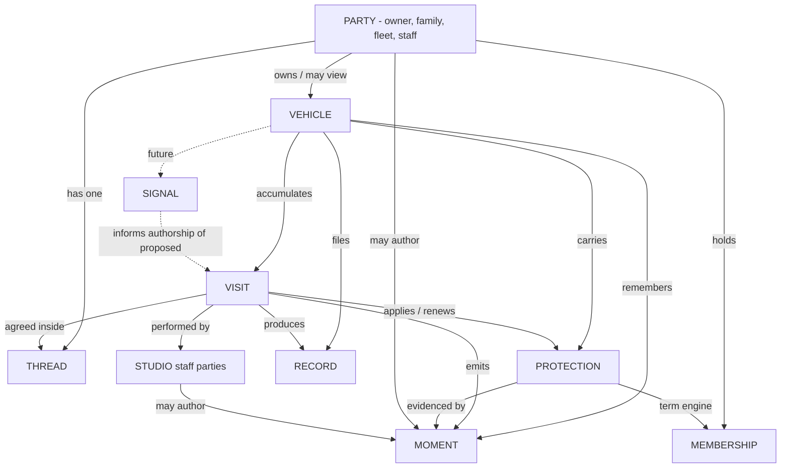

# AUTOMODZ CUSTOMER PRODUCT CONSTITUTION

**Status: RATIFIED (2026-07-20), as amended.** Architecture is frozen. This is the law of the customer product; no further philosophy documents will be produced.
**Replaces:** every prior product document (`CX-V3-REBOOT-AUDIT.md`, `CX-V3-FINAL-BLUEPRINT.md`, `AUTOMODZ-CUSTOMER-OS.md`). They remain as history; this is the law.
**Read this first.** If you are a designer, engineer, or PM on day one: this document is why the product is shaped the way it is. Before adding anything, check whether it violates an article here. If it does, either don't build it, or amend the constitution first - deliberately, in writing.

---

## Preface - the demolition record

This constitution was produced by attacking the previous architecture as if a rival team had built it. Four load-bearing findings changed the design; they are recorded so no one re-litigates them casually:

1. **Proposal did not deserve to be an object.** Stress-tested against "I just want a wash today," emergencies, and fleets, the studio-proposes-only model broke: customer-initiated care was demoted to a hidden gesture, which is hostile. The repair made the model smaller, not bigger: *a proposal is simply a Visit in its first state, and anyone may author it* - the system, the studio, or the customer. Booking and proposing collapse into one thing: **agreeing on a visit**. The object count went down and the emergency case became first-class.
2. **Memory had no atom.** "Memories" was a layer rendered from visits - a gallery, not a story. The missing primitive is the **Moment**: one photograph-or-note with a time and an author. Visits emit moments; the studio emits moments; *the customer emits moments* (delivery day, road trips, the kid's first ride). AutoModz becomes the memory keeper of the vehicle because the timeline accepts memories from life, not only from invoices.
3. **People were missing from a relationship product.** Craftsmen appeared in copy ("Deepak is hand-finishing the hood") but not in the model; family and fleet roles were an afterthought. **Party** now generalises every human and organisation on both sides. Trust is built by *people*, and people must be objects.
4. **Protection and Membership were secretly the same machine.** Both are promises with a term: active → waning → expiring → renewed/lapsed. They stay distinct objects (one shields a vehicle, one binds a relationship) but run on **one Term Engine** - one implementation of expiry, grace, renewal, and the notifications those edges emit. Insurance, warranty, RSA, and AMC will run on the same engine untouched.

Everything else survived the attack and is ratified below.

---

# PART I - PHILOSOPHY

## Article 1 · Product philosophy

The customer does not use an app. **They own relationships - with their vehicle, with the people who care for it, with the story both accumulate - and the product is where those relationships are visible and alive.**

The constitutional sentences:

1. **The car is the product.** The customer's own vehicle, photographed and current - never our catalogue, never our dashboard.
2. **Every surface answers "what is happening with my car?"** - never "which feature do you want?"
3. **Ownership is daily; transactions are occasional.** Build for the 355 days between visits; the visit must merely be worthy of them.
4. **Photography first, content second, controls last.**
5. **The emotional hierarchy is fixed:** My Car → Current Care → Protection → Memories → Relationship → Transactions. No surface may invert it.
6. **Everything derives from real data.** Absence degrades elegantly. Nothing is faked - no placeholder chapters, no invented names, no manufactured urgency.
7. **The product is an object system, not a page system.** Screens are temporary renderings; objects are permanent. We will redesign views many times in ten years; we will never redesign the objects.
8. **There is one interaction model: the conversation** (Article 8). Every verb in the product is either *looking at the car* or *talking with the studio*.

## Article 2 · Mental model

The customer holds exactly three ideas, and every screen maps to one:

- **"My car"** - its portrait, its state, its protection, its story. *(the Glance)*
- **"My studio"** - the people who care for it, whom I can always reach and who sometimes write to me. *(the Conversation)*
- **"Right now"** - when my car is in their hands, I can watch. *(the Stay)*

If a feature cannot be explained as belonging to one of these three ideas, it does not belong in the product. There is no fourth idea. There is especially no idea called "my account."

---

# PART II - THE OBJECT MODEL

## Article 3 · The nine objects (+ one reserved)

The product is nine permanent objects. A tenth (Signal) is reserved. Every screen is a view of an object; every notification is an object speaking; every future feature is a new instance, subtype, or author of an existing object. **A new object requires a constitutional amendment.**

| Object | One-sentence definition | Owner |
|---|---|---|
| **Party** | Any human or organisation: an owner, a family member, a fleet manager, a craftsman, a studio's staff | root |
| **Vehicle** | The car - aggregate root of everything physical | Party (a party group) |
| **Visit** | One agreed act of care, from first suggestion to archived chapter - *this object absorbs booking, proposals, and tracking* | Vehicle |
| **Protection** | A promise that shields the vehicle over time: coating, PPF, plan → insurance, warranty, RSA, tyres | Vehicle |
| **Membership** | A promise that binds the relationship over time: the Club standing | Party |
| **Record** | A document: care record/invoice, inspection report, RC, policy | Vehicle |
| **Moment** | The atom of memory: one photograph or note, with a time and an author | Vehicle (its timeline) |
| **Studio** | The party that performs care - a Party subtype with bays, staff, and a location | root |
| **Thread** | The one conversation between a party and AutoModz - every message, every visit agreement, forever | Party |
| **Signal** *(reserved)* | A measurement about the vehicle: odometer, fuel, AI assessment. Not built until true. | Vehicle |

**What merged, and why it now feels inevitable:**
- *Proposal → Visit.* A visit's first state is `proposed`, and it has an **author**. The machinery of suggesting, requesting, and booking is one machine.
- *Chapter → a view.* A chapter is the archived Visit rendered with its Moments. Not an object.
- *Customer → Party.* Households, fleets, craftsmen, and studios are all parties with roles. One mechanism carries family garages, business fleets, and technician introductions.
- *Protection + Membership → two objects, one Term Engine.* Term logic (expiry, grace, renewal, edge notifications) is written exactly once.

## Article 4 · The relationship model



**Ownership law:**
- **The Vehicle owns everything physical** - visits, protections, records, moments. When a car is sold, its story travels with it (amounts redacted). A verified, transferable history is the resale moat; this single rule creates it.
- **The Party owns everything relational** - membership, the thread, and access to vehicles (as *owner* or *viewer*; family and fleets are role assignments, not features).
- **The Studio owns nothing customer-side.** It is stamped onto visits and memberships. Ten studios, franchises, pickup hubs, and mobile units are all parties performing visits - a data change, never a redesign.
- **The Thread carries agreements but owns none of their outputs.** Conversation is the medium; the vehicle is the ledger.

## Article 5 · The two spines (relational and chronological)

Businesses think relationally; customers think chronologically. The architecture honours both, without duplication:

- **The object graph is the spine of truth.** Current state - what protects the car, what's agreed, what's owed - is always read from objects. Truth is never inferred from the timeline.
- **The Timeline is the spine of memory.** Every object *projects* Moments onto the vehicle's single chronological stream: visits project their evidence chain, protections project "applied" and "renewed," the term engine projects milestones, parties project their own photographs, the relationship projects anniversaries. The Memories experience *is* this stream - one story, many authors.
- One rule keeps them clean: **objects own truth; the timeline owns meaning.** A screen showing "what is" reads the graph; a screen showing "what happened" reads the timeline. No screen mixes the two sources for the same fact.

---

# PART III - THE LIFECYCLES

The UI is a rendering of these machines. Screens do not have states; objects do.

## Article 6 · Visit lifecycle (booking, proposing, and tracking - one machine)

```
PROPOSED(author) → AGREED → [PICKUP*] → ARRIVED → INSPECTED → IN_CARE ⟳ → FINISHED → REVEALED → [RETURN*] → ARCHIVED
        │              │                                                                            │
        └ declined /   └ prep note scheduled                                （* future phases）      └ renders as a chapter
          expired silently
```

- **`PROPOSED` has an author: system, studio, or customer.** The system authors from term edges and cadence ("the ceramic is due its maintenance wash"); the studio authors personally through the thread; **the customer authors by asking** - "I want a wash today" is a customer-authored proposed visit, first-class, served immediately in the conversation. Emergencies are simply customer-authored visits with urgency; nothing special exists for them because nothing special is needed.
- **Discipline:** at most one open system-authored proposal per vehicle; every system proposal names its reason; declined proposals never return in the same form; unexplained suggestions are constitutionally banned (an unexplained suggestion is marketing).
- **`AGREED`** replaces "booked." The word booking is retired from the product's vocabulary along with tracker.
- **The five acts** (Arrived → Inspected → In-care → Finished → Revealed) are the hospitality arc - the Stay. Ops's internal statuses map into acts through one translation layer; ops vocabulary constitutionally never renders customer-side.
- Pickup/return phases and new visit kinds (`rescue` for RSA, `service`, `fitment` for accessories) slot into this same machine.

## Article 7 · The other lifecycles

**Vehicle:** `ADDED → PORTRAIT_MADE → IN_CARE_CYCLE ⟳ → LISTED? → TRANSFERRED | RETIRED`. A vehicle is incomplete until photographed. Retired vehicles keep their timeline forever - the story is never deleted. Listing generates the `/cars` presence from the object graph.

**Term Engine** (Protection *and* Membership): `APPLIED/JOINED → ACTIVE → WANING(30d) → EXPIRING(7d) → EXPIRED/GRACE(7d) → RENEWED | LAPSED`. Each edge may emit at most one system-authored proposed visit and one push. Protections are born from work (a completed coating visit auto-creates its protection, evidenced by that visit's moments) - never from data entry. Renewal chains to its ancestor: "protected since 2026." Lapse is rendered with dignity; status anxiety is not a retention lever.

**Party (customer):** `ONBOARDING → OWNER ⇄ MEMBER → DORMANT → RETURNING`, with `ADVOCATE` recognised, not gamified. Onboarding ends when a photographed vehicle exists. Dormancy (no visit in ~2× personal cadence) earns exactly one human line in the thread, ever. The passport never resets.

---

# PART IV - THE INTERACTION MODEL

## Article 8 · Concierge philosophy: the conversation IS the operating system

Ruling on the founder's question - the concierge is not a feature. **It is the product's second half.**

The product has exactly two hemispheres:

- **The Glance** - *looking at the car.* The root surface: portrait, truth line, layered depth (care · protection · timeline · identity · relationship), swipe between vehicles. Zero navigation chrome. Serves the daily three-second visit.
- **The Conversation** - *talking with the studio.* One thread, reached through the ever-present **capsule**. Book, renew, ask, complain, thank, schedule, emergency - there are no six verbs; there is one: *say it*. Structured cards ride inside the conversation (a proposed visit with its one-tap "yes", a term renewal, a join-the-club card), so agreeing is a tap but everything is conversationally addressable. Support is not a department; membership is not a section; booking is not a flow. They are all sentences.
- **The Stay** is not a third hemisphere - it is the Glance, transformed by state, narrated by the Conversation.

**The Desk survives as the conversation's index, not as navigation:** opening the capsule shows the thread, and above it the adaptive object shelf (this car's care · protection · records · club · the studio · you) plus search across chapters, records, and protections. The eight arrival intents from the OS review all resolve here in ≤2 gestures; recall at year three is a query, not a browse. Navigation philosophy in one line: **the Glance never gains chrome; the Conversation absorbs all intent.**

Voice law (unchanged, now constitutional): one calm expert host; the car by its name; reasons always given; sentence case; no exclamation marks, no emoji, no urgency, no guilt, no ops vocabulary. At launch the thread's human half is WhatsApp deep-linked; the architecture treats that as an implementation detail of the Thread object.

## Article 9 · Trust philosophy: trust is manufactured at named moments

Luxury is trust, and trust is never ambient - it is earned at specific, designed instants. The canonical **trust ledger** every visit walks:

1. **The agreement** - price and scope known before arrival; no surprises is the baseline of luxury.
2. **The custody handshake** - arrival photograph, timestamped: "your car, in our hands, 9:58."
3. **The honest inspection** - the walk-around, with photos, *before* work: the kerbed rim and existing swirls named before anything is sold. Being told what's wrong before being sold what's next is the single highest-yield trust act in the product.
4. **The introduction** - the craftsman is a Party with a name and a face: "Deepak will be looking after the C 43 today."
5. **The evidence** - work moments, close and honest, as they happen.
6. **The quality pass** - final checks narrated as their own act, not hidden inside "in progress."
7. **The reveal** - the finished car, photographed before the customer sees it; first sight happens in the product.
8. **The promise** - protections created from the work, with real expiries, evidenced by the visit's own photographs.
9. **The follow-up** - one human line days later ("How's the coat behaving? First maintenance wash is on us in March.").

Every one of these is a Moment or Record in the model - trust is not a feeling we hope for; it is output the system emits. Any redesign of the visit must preserve all nine or amend this article.

## Article 10 · Memory philosophy: the story, not the gallery

AutoModz is the **memory keeper of the vehicle**. The timeline is a story with many authors, not a folder of our photos:

- The studio contributes the evidence chain and the portraits. The term engine contributes milestones ("one year protected," "tenth visit"). The relationship contributes anniversaries ("two years with AutoModz," "the day the C 43 arrived").
- **The customer contributes life:** delivery day, road trips, the mountains, the kid's first ride. Adding a moment is one gesture from the timeline. Their car's story should live here *because it is better kept here than in a camera roll* - organised by the car, interleaved with its care, transferable with the vehicle.
- Curation over accumulation: the timeline surfaces *chapters and peaks*, not every frame; the full set lives one tap deeper. Yearly, the product composes the vehicle's year - its best portraits, its work, its journeys - as a shareable piece (the organic-growth artifact).
- Tone law: memories are never leveraged ("remember this? book now!"). A memory resurfaced (anniversary, "a year ago today") arrives as a gift with no call to action. Delight and revenue must never share a sentence.

## Article 11 · Delight philosophy: reasons, not notifications

What makes someone open the app when nothing is happening: the truth line is always *true* (a living countdown of protection, a car that looks after), and the timeline occasionally *gives* - an anniversary, a milestone, a studio note, a resurfaced memory, a seasonal word ("monsoon's coming - the underbody check is wise"). Budget law: outside live visits, **at most two pushes a week and at most one delight-class moment a week**, and every one must be about *their* car or *their* story. The product never performs delight; it practices attention. (A "care score" was considered and **rejected**: scoring a customer's care of their own car is judgment, not hospitality - the truth line says "healthy," never "87%.")

## Article 12 · AI philosophy: intelligence is authorship, not interface

Where AI lives, ruled: **inside the conversation, as an author - never as a feature, a chatbot page, or a screen.**

- AI's only outputs are things the model already has: better-timed, better-reasoned **proposed visits** (from term edges, cadence, season, and someday Signals); better **sentences** (the truth line, moment captions); and **drafts for the studio's human half** of the thread.
- Human-in-the-loop is the launch posture: AI drafts, the studio sends. The concierge's voice is one person; AI serves that person.
- AI never fakes: no invented observations, no hallucinated condition claims. Anything AI asserts about the car must trace to an object (a photo, a term, a signal). When vehicle-health AI arrives it is a **Signal interpreter authoring proposed visits** - it gets no screen at all, because in this architecture intelligence manifests as *a concierge who knows the car better*, which is invisible and priceless.

---

# PART V - CRAFT LAW

## Article 13 · Visual, motion, and photography philosophy

- **Visual:** Studio White - light-first customer surfaces, paper and warm greys, graphite ink; drama belongs to photography, chrome stays gallery-quiet. Almost no borders, almost no cards (the member card is the deliberate exception), one radius, the 4pt grid with the four spacing numbers, the single type scale, mono for data glyphs only, sentence case everywhere. Admin and store remain always-dark; the boundary is absolute.
- **Motion:** motion is state changing, never decoration. One ease `(0.22, 1, 0.36, 1)`; three durations (120/280/480ms); two signature scene animations only (the takeover breath; the visit-becomes-memory dissolve); reduced-motion collapses scenes to cross-fades; loops, pulses, glows, and parallax are banned inside the product.
- **Photography:** every photograph has a communicative job - the **evidence chain**: portrait (identity) · arrival (custody) · inspection (honesty) · craft (competence) · finished (the reveal) · detail (the promise, on the protection). Wide → close → macro → wide across the visit. No filters; scrim only; text never over the middle of an image; degradation is typographic dignity, never placeholder boxes or stock cars. The studio's camera habit is a product dependency and ships as first-class admin tooling, not an afterthought.

## Article 14 · Notification philosophy

Notifications are **objects speaking, through the concierge's one voice, on the lifecycle's schedule** - the machines of Part III are the *complete* list of what may emit: visit acts (arrived and revealed always; craft moments opt-in), term edges (once each), the weekly delight budget, and nothing else. Every push deep-links to the exact object state. There is no bell, no inbox, no badge counts; the capsule and the truth line are the ambient surface, and history lives in the thread. Preferences are plain sentences with switches.

---

# PART VI - PRINCIPLES & ROADMAP

## Article 15 · Design principles (the review checklist)

1. Does this surface answer "what is happening with my car?"
2. Is this a view of an object, or a new page pretending to be one?
3. Does it read chronologically for the customer and relationally for the system?
4. Photography first, content second, controls last - in that order on the actual screen?
5. One decision per screen; two primary buttons means the screen is wrong.
6. Would this feel at home in a CRM? Then it is banned.
7. Does absence render as silence or invitation - never as an empty-state card?
8. Does every suggestion name its reason?
9. Does it hold at year three: 200 moments, 3 cars, 6 protections, 2 studios?
10. Is anything faked? Then it does not ship.

## Article 16 · Engineering principles

1. **The store mirrors the object model** - one slice per object; views select, never own. Derived truth (`truthOf`, `careMoment`, `healthOf`, term states) is pure functions, never stored.
2. **The translation layer is a hard boundary** - grep-enforceable: no ops vocabulary under the customer tree.
3. **The Term Engine is written once** and shared by Protection and Membership (and everything the future runs on it).
4. **Lifecycles are unit-tested as machines** before any view renders them.
5. **Delete as you go** - a phase that ships a replacement deletes its predecessor in the same phase; two generations never coexist.
6. **Twelve components** (`Portrait · TruthLine · Capsule · Desk · Layer · PhotoBand · MomentEntry · MomentStage · MemberCard · Sheet · Field · Action`) + four text primitives; a thirteenth requires amendment. No inline font sizes; tokens only.
7. **Cold start renders cached truth instantly** and corrects silently; the only spinner lives inside a pressed button.
8. **Offline is a state, not an error** - last-known truth + one whisper line.

## Article 17 · Scalability philosophy & future roadmap

**The growth contract:** a new capability must land as (a) a new *instance/subtype/author* of an existing object, (b) at most one new shelf row in the Desk, and (c) proposals that obey the reason-and-budget law. It ships only when **true** (real data) and **quiet** (fits the grammar). If it needs a new object, a new hemisphere, or a tab - amend the constitution or don't build it.

Placement of the known future: insurance/warranty/RSA/tyres → Protection types on the Term Engine; RC/PUC/financing papers → Record kinds on the same expiry logic; full service history + odometer → `service` visits + Signals; fuel & AI health → Signals interpreted into authored proposals; accessories → `fitment` visits offered conversationally (never a store tab); marketplace/resale → the vehicle graph *is* the listing; pickup hubs & mobile detailing → visit phases and studio subtypes; franchises & multi-studio → studio parties; family garages & corporate fleets → party roles + one roll-up *view*. None of these are commitments; all of them are already homes.

**Implementation roadmap** (each phase releasable; deletion discipline per Article 16.5):
**P0** Objects, lifecycle machines, Term Engine, translation layer, tokens, components - *gate: machines unit-tested; styleguide renders all twelve.*
**P1** The Glance (portrait, truth line, capsule, multi-car, layers on real objects; You sheet) - deletes dashboard home, bottom nav, profile/notifications/offers/refer, `/dashboard/cars` - *gate: 3-second glance from cold start.*
**P2** The Conversation (thread + desk + search; visit agreement cards; customer-authored visits incl. "wash today"; system proposals v1) - deletes the wizard - *gate: all eight arrival intents in ≤2 gestures; "wash today" agreed in one exchange.*
**P3** The Stay (five acts, evidence chain, reveal, the two signature animations) **+ studio capture tooling in the same phase** - *gate: full visit end-to-end, including photo-less degraded mode.*
**P4** The Timeline (moments, customer-authored memories, chapters, share URL absorbing `/invoice/[id]`, V2 data migrated into chapters, in-context rating) - deletes history - *gate: a 2025 booking renders as a dignified chapter.*
**P5** Terms (protection auto-creation, waning/expiring proposals, documents, value/sell) - *gate: completed ceramic emits its renewal proposal on schedule.*
**P6** The Relationship (member card, join, benefits-in-context, renewal, referral, follow-up moment) - deletes subscriptions - *gate: join → active → renewing verified.*
**P7** Onboarding + the ten-year polish (first car + portrait, empty/loading doctrine, budgets, performance: portrait LCP <2.5s on 4G; final V2 sweep) - *gate: the mental model of Article 2 is the whole app; grep finds nothing deleted still imported.*

---

# PART VII - AMENDMENTS (ratified with the Constitution)

## Amendment I · The Vehicle Digital Twin - the north star

The Vehicle object is not a garage entry. **It is the permanent digital twin of the customer's real car**, and the twin is the product's north star: the customer must eventually think *"my car lives inside AutoModz"* - never *"my detailing history lives inside AutoModz."*

Constitutional consequences:

1. **Every interaction must enrich the twin.** Any feature, flow, or integration proposed in the future faces one gating question before Articles 15–16 even apply: *what does this permanently add to the Vehicle?* A feature that touches the car but writes nothing durable to its twin - no moment, record, protection, term, signal, or fact - is either redesigned until it does, or rejected.
2. **The twin's eventual anatomy is already homed in the object model** - no future dimension may invent a new home: identity & documents → Records + Identity facts on Vehicle; photography & memories → Moments; visits & service/damage/maintenance history → Visits (of any kind) and their evidence; protection, warranty, insurance, tyres, battery health → Protections on the Term Engine; accessories → `fitment` Visits + Records; ownership history → Party role transfers on the Vehicle; AI observations → Signals and their authored proposals. If a genuinely new dimension of the car appears, it enters through an amendment, not a workaround.
3. **The twin is the asset.** Completeness of the twin is the product's real inventory and the customer's real switching cost - a verified, transferable, photograph-rich vehicle history that no competitor and no marketplace can reconstruct. Resale, insurance, and financing features of the future are *consumers* of the twin, never separate databases.
4. **The twin outlives everything around it:** owners (transfer), studios (multi-party), screens (redesigns), and this decade's feature set. Nothing may be built that would strand data outside it.

## Amendment II · Every Visit Creates Value

A visit does not end when the customer leaves. **Every completed visit must leave the Vehicle measurably richer than before it arrived** - this is the retention engine, stated as law:

1. **The minimum yield of any completed visit** - enforced at the object level, not left to good intentions: at least one new **Moment** (photography - at minimum arrival + finished), one **Record** (the chapter/care record), and one forward-looking element (a Protection applied or renewed, a next-due seed, or a reasoned future proposal). A visit that archives without its minimum yield is an ops defect, surfaced to the studio like an unbalanced ledger.
2. **The full yield, as the studio's habit matures:** better portraits than the customer had, craftsmanship evidence, honest condition knowledge (inspection findings become part of the twin's damage/condition history), documents, warranty terms, and the follow-up moment. The evidence chain of Article 13 is not documentation of the visit - it is *deposit into the twin*.
3. **Value must be felt, not just stored.** The reveal and the archived chapter must make the deposit visible: what was done, what was added, what is now protected, what the car's story gained. The customer leaves every visit with a car that is better *and* a twin that is richer - and can see both.
4. **Therefore no visit kind may ever be "transactional."** Future kinds (rescue, fitment, pickup, mobile) are bound by the same minimum yield. If a proposed service cannot enrich the twin, it does not belong in the product.

---

# PART VIII - THE FREEZE & IMPLEMENTATION RULES

**The architecture is frozen as of ratification.** No more redesigns, constitutions, or philosophy documents. The remaining path is execution, in this order:

1. Information Architecture → 2. UX Flows → 3. Wireframes → 4. High-Fidelity UI → 5. Component System → 6. Engineering Plan → 7. Implementation.

Binding rules from this point onward:

- Never redesign architecture while implementing.
- Never introduce new design languages, temporary UI, or placeholders.
- Never duplicate components, flows, or data models.
- **If implementation reveals an architectural flaw: stop, document it, return for founder approval.** Otherwise continue building.
- The Constitution is the single source of truth for every future customer-facing feature. A feature request is evaluated first against Amendment I's gating question, then Articles 15–16, then built - or amended into law, or declined.

---

## Ratification

This constitution was ratified by the founder on 2026-07-20, with Amendments I and II incorporated at ratification. Every decision herein is intended to feel obvious in hindsight: *of course* the car is the screen and the studio is a conversation; *of course* booking is just agreeing to a visit anyone may propose; *of course* memory has an atom, trust has a ledger, the vehicle is a twin, and every visit deposits into it.

**Implementation begins at Phase 0. This file is the first thing every new person reads.**
