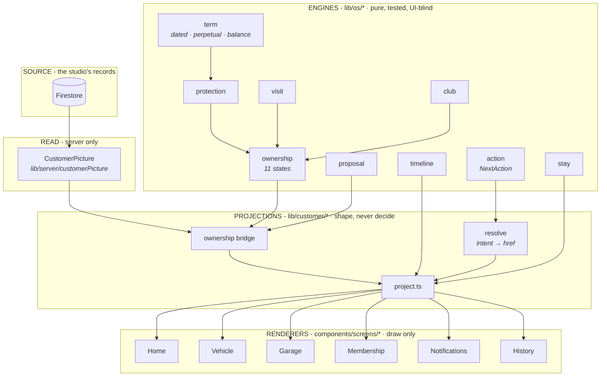
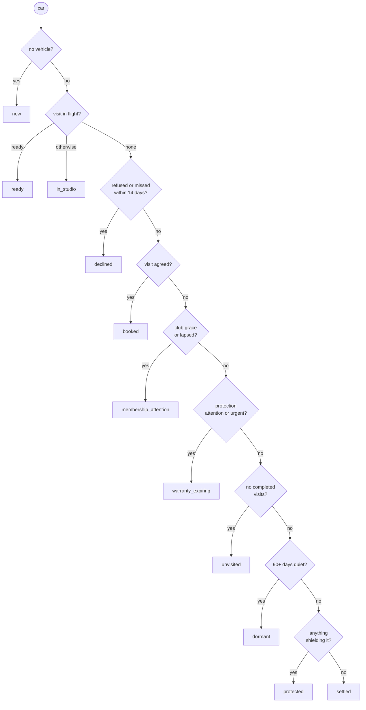
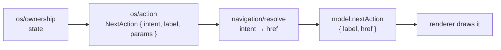

# AUTOMODZ OS - ARCHITECTURE

**The single source of truth.** Every surface - Home, Vehicle, Garage,
Membership, Notifications, History, Studio, and in time Admin - is built from
what is written here. A feature that cannot be expressed in these terms is a
signal that the architecture is wrong, not that the feature needs an exception.

Companion documents: [`AUTOMODZ-OS.md`](AUTOMODZ-OS.md) is the design
constitution (what things look like and why). [`HOME-STATE-MAP.md`](HOME-STATE-MAP.md)
is the state contract for one surface. This document is the machine underneath
both.

---

## 1 · The one law

> **Engines decide. Projections shape. Renderers draw.**

Three layers, one direction of travel. Nothing skips a layer and nothing flows
backward.

### What each layer may and may not do

| Layer | May | Must never |
|---|---|---|
| **Engine** (`lib/os/*`) | Decide state, health, precedence, wording of facts | Import React, know a route, know a screen, read Firestore |
| **Projection** (`lib/customer/*`) | Shape engine output into a model, resolve intents to routes, format dates | Decide state, re-derive a lifecycle, branch on anything an engine already answered |
| **Renderer** (`components/screens/*`) | Draw the model, own layout and motion | Contain business logic, build a URL, branch on domain conditions |

**The renderer test:** if a screen file contains a `switch` on a domain value, a
string beginning `/`, or a date calculation, it is doing a job that belongs one
layer down.

---

## 2 · The objects

Seven. Every surface is a projection of these and nothing else. New features
extend an object or add a projection of one - they do not add an eighth.

| Object | Identity | Owned by |
|---|---|---|
| **Car** | the vehicle, its identity and photograph | `CarPicture.vehicle` |
| **Protection** | a promise about the car, with a term | `os/protection` + `os/term` |
| **Visit** | an occasion the car was with us | `os/visit` |
| **Membership** | the relationship, not the car | `os/club` |
| **Timeline** | ownership laid out in time | `os/timeline` |
| **Studio** | the place | `lib/company` |
| **Owner** | the person | `CustomerPicture.user` |

**Timeline is an OS object, not a Home object.** It was projected inside Home's
model first; that was wrong. A record of ownership is not a feature of one
screen. It lives in `lib/os/timeline.ts`, is emitted from the same seven
objects, and is consumed by Home, Vehicle, History and Notifications without any
of them owning it.

---

## 3 · The engines

Every engine is pure, synchronous, unit-tested and knows nothing about React,
routes or screens. That is what makes them reusable across customer and admin.

| Engine | Answers | Notes |
|---|---|---|
| `os/term` | How healthy is a promise? | `dated · perpetual · balance` → `healthy · attention · urgent · lapsed`. **The one lifecycle.** |
| `os/protection` | What shields this car? | Stored protections through `liveProtection`; falls back to derivation for pre-seal cars |
| `os/visit` | What phase is this occasion in? | `proposed · agreed · live · archived · cancelled`, and the five care acts |
| `os/club` | Where does the membership stand? | `none · pending · active · grace · lapsed` |
| `os/ownership` | **What is the position of this car?** | 11 states, fixed precedence. The centre of the system. |
| `os/proposal` | Is there one true thing to recommend? | At most one per vehicle. A layer, never a state. |
| `os/timeline` | What has happened, and what is coming? | Runs forward as well as back |
| `os/action` | What is the single next thing to do? | Emits `NextAction` - an object, never a link |
| `os/stay` | When will the car be ready? | Respects business hours |

### The ownership state machine

Resolution is **top-down, first match wins**. This order is the product's
priority judgement.

`needs_care` is **not** a state. The proposal engine modifies the three steady
states (`protected`, `settled`, `dormant`) only. A car cannot be both in the
studio and overdue for a wash - live facts outrank recommendations.

---

## 4 · Projections

A projection converts engine output into exactly what one surface draws. It
contains **no decisions**, only shaping.

| Projection | Surface | Emits |
|---|---|---|
| `toHome` | `/` | state · liveActivity · protections · nextAction · timeline · studio |
| `toVehicle` | `/vehicle` | identity · protections by region · timeline · nextAction |
| `toGarage` | `/garage` | the collection, each with its state word |
| `toMembership` | `/membership` | club standing · entitlement · nextAction |
| `toHistory` | `/history` | timeline, unabridged |
| `toNotifications` | *(future)* | timeline events that crossed a threshold |

Every projection reads the **same** `stateWordFor`. The same car says the same
word on every screen - a test enforces it, because it has already broken once.

### Live Activity

What was called "Current Story" is **Live Activity**: what is happening to the
car *now or most recently*. The rename is not cosmetic - "story" invited
narrative padding, "activity" is a fact with a time on it. It is the region that
carries a live visit, and when nothing is live, the most recent finished work.

### NextAction - an object, not a link

The renderer must never build a URL. The engine emits an **intent**; a single
resolver maps intent to address.

The engine names *what should happen* (`arrange_visit`, `manage_visit`,
`follow_visit`, `renew_membership`, `add_car`, `renew_protection`). Only
`navigation/` knows addresses, because only `navigation/` owns the route table.
Change a route and one file changes.

**Why not put the href in the engine?** Because `os/*` is shared with Admin,
which has entirely different addresses for the same intents. An engine that
knew `/studio` could never be reused by a surface where the same act lives at
`/admin/bookings/new`.

---

## 5 · Navigation philosophy

> **Do not navigate when you can open.**

A route change is a change of *place*. Opening an object you can already see is
not a change of place, and animating it as one breaks the sense that the object
was there all along.

| Movement | Mechanism |
|---|---|
| Room → Room (Home ↔ Garage ↔ History ↔ You) | Route change, `BottomNavigation` |
| Room → deeper room (Garage → Vehicle) | Route change, no shared element |
| Object → its detail (Protection, Timeline event, Membership, Chapter, Warranty) | **Contextual expansion in place** |
| Anything → arranging a visit | Route to `/studio`, because it is a place |

**Why expansion and not routes for objects.** Next.js App Router unmounts the
outgoing tree on navigation, so Motion's `layoutId` cannot bridge two routes -
verified, not assumed. Rather than fight that, the architecture takes it as
confirmation of the right model: Apple Wallet and Photos do not navigate to a
card, they open the one you are looking at.

Every expansion is still **addressable** (`?open=protection:p2`) so it can be
linked, shared, and restored on reload. Addressable does not mean it is a page.

---

## 6 · Interaction philosophy

- **One primary action per surface.** `os/action` emits one `NextAction`. If a
  screen appears to need two, the state is under-modelled.
- **Behaviour is borrowed; appearance never is.** Radix supplies focus traps,
  dismiss layers, keyboard navigation and ARIA. Every visual value comes from
  `design/`. No Radix stylesheet is imported, ever.
- **One implementation of anything.** There is one `Button`, one `BottomSheet`,
  one dismiss behaviour. A second is a defect, not a variant.
- **Absence is silence.** A region with nothing to say renders nothing - never a
  placeholder, never an empty card.
- **The customer's words.** No status codes, no catalogue SKUs, no internal
  vocabulary reaches a screen. Engines emit customer language or the projection
  supplies it.

---

## 7 · Motion philosophy

> **Motion communicates state. It is not decoration.**

Motion is the **last** phase of any feature, after architecture and interaction
are correct. A screen that needs animation to feel finished is not finished.

| Permitted | Purpose |
|---|---|
| Shared element (`layoutId`) | The object you opened is the object you tapped |
| Layout animation | Something changed size or place, and you should see which |
| Spring physics | Weight - from `design/motion.ts`, never hand-tuned |
| Scroll-linked | Parallax on the one photograph |
| Staggered reveal | Order of reading, on first paint only |
| Gesture | Direct manipulation - drag to dismiss |

**Forbidden:** decorative fades, entrance animations on every element, motion
that delays a fact the customer is waiting for, anything that cannot be disabled
by `prefers-reduced-motion`.

Every duration and easing comes from `design/motion.ts`. A number typed into a
component is a defect.

---

## 8 · Adding a feature

1. **Which of the seven objects is this?** If none, stop - reconsider.
2. **Which engine answers it?** Extend an engine; never add logic to a
   projection or a screen.
3. **What does it project into?** Add to a model, or add a projection.
4. **What is the NextAction?** Add an intent, resolve it in `navigation/`.
5. **Does it open, or does it go?** Default is open.
6. **Build the renderer.** No logic, no URLs.
7. **Motion last.**

## 9 · Enforcement

These are checked by tests, not by review alone:

- No screen imports Firebase or the store - `perf/no-client-firebase.test.ts`
- Every surface says the same state word - `customer/project.test.ts`
- Every action reaches a real destination - `customer/project.test.ts`
- Engines have no React import - *added with this document*
- Renderers contain no route literals - *added with this document*
